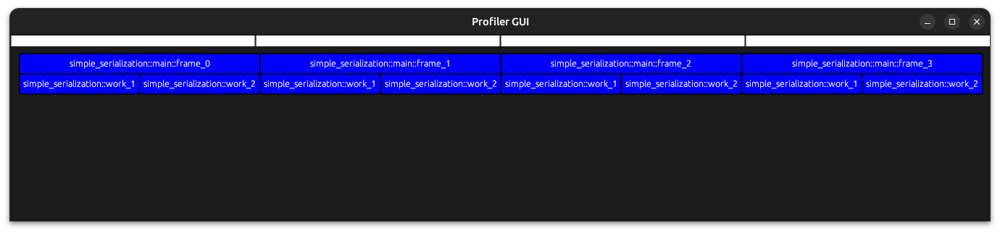

# profiler
simple rust instrumentation profiler

Disclamer: this is just a toy project

!Make sure that you add the "enable_profiling" feature when you want to profile!
```toml
profiler = { git = "https://github.com/Peanutt42/profiler", features = ["enable_profiling", "attribute"] }
```


```rust
#[profile]
fn work_1() {
    std::thread::sleep(std::time::Duration::from_millis(500));
}

#[profile]
fn work_2() {
    std::thread::sleep(std::time::Duration::from_millis(500));
}

fn main() {
    for i in 0..4 {
        new_frame!();

        scope!(format!("frame_{i}"));

        work_1();
        work_2();
    }

    save_to_file!("saved.profiling");
}
```

